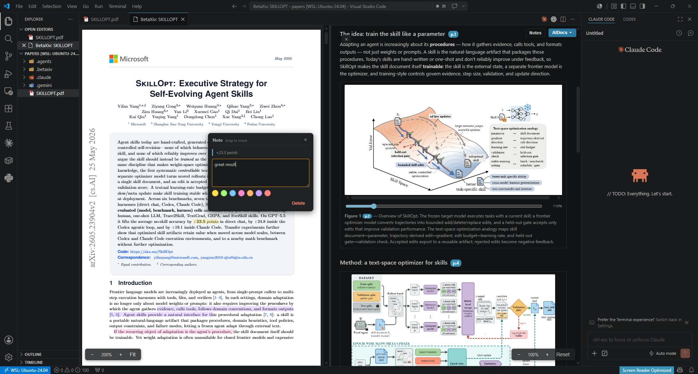

<div align="center">


# BetaXiv

**Read papers in VS Code with the frontier model you _already pay for._**
No second subscription. No per-token API key. Nothing leaves your machine.

_An alphaXiv-style paper-reading experience — the real PDF beside an AI-written structured read,
figures and math intact — without ever leaving your editor._

[](https://marketplace.visualstudio.com/items?itemName=kevin-os7.betaxiv)
[](https://marketplace.visualstudio.com/items?itemName=kevin-os7.betaxiv)
[](LICENSE)

</div>

<div align="center">



</div>

**The same AI-assisted reading flow — structured explanations and on-demand docs beside the
paper — but inside your editor, fully local, and powered by the agent subscription you already
pay for.**

The real PDF on the **left**. An AI-generated **structured summary** — plus any **AIDocs** you
ask for — on the **right**. Both are written by **your own coding agent** (Claude Code / Codex /
Gemini CLI) running a bundled Agent Skill, under your own login.

The extension itself is a **pure renderer**: it reads JSON from disk and draws it. It *never*
calls a model, touches OAuth/API keys, launches an agent, or makes a network call.

## Why BetaXiv

- **🔑 Use the subscription you already have.** Summaries come from your existing Claude / Codex /
  Gemini agent — no extra subscription, no API key, no per-token billing.
- **🔒 Fully local & private.** Zero model or network calls from the extension. No telemetry, no
  accounts. PDFs and summaries never leave your machine.
- **📄 The real paper, not a reflow.** Left pane is the actual PDF via PDF.js — figures, equations,
  layout intact — beside a clean, structured read on the right.
- **🧩 More than a summary.** Ask your agent for comparison tables, method flowcharts, or
  derivations on demand — they render right next to the paper.

## How it works

```
papers/foo.pdf ──► your agent runs the betaxiv-summarizer skill
                          │  (reads the PDF, writes JSON)
                          ▼
   .betaxiv/summaries/<id>.summary.json   ◄── the versioned contract
                          ▼
   BetaXiv renders: PDF left, summary right (live-reloads on change)
```

`<id>` is the first 16 hex of the PDF's SHA-256, so the summary follows the paper through any
rename or move.

### AIDocs — beyond the summary

The **summary** is one fixed artifact. **AIDocs** are open-ended documents your agent writes on
request — a results table with extra models it fetched, a method flowchart, a derivation, a
glossary of a subfield. They live next to the summary and appear in the right pane's **AIDocs**
dropdown.

Docs are authored *declaratively*: the agent writes prose, **tables**, and **Mermaid diagrams**
(flowcharts, sequence/state diagrams, `pie`/`xychart` charts), which the extension renders to SVG
locally. The agent never draws raster images — it declares, the extension renders.

## Requirements

BetaXiv is a **renderer**, not an AI client. To produce summaries and AIDocs you need a coding
agent installed locally — **Claude Code**, **Codex**, or **Gemini CLI** — running under your own
login. The extension makes no model or network calls of its own.

## Getting started

1. **Install the skills.** Run **BetaXiv: Install Skills into Workspace** from the Command
   Palette. It copies both `betaxiv-summarizer` and `betaxiv-documenter` into `.agents/skills/`,
   `.claude/skills/`, and `.gemini/skills/` (it only writes files — it never launches an agent).
2. **Drop a PDF** into your workspace (e.g. a `papers/` folder).
3. **Open it.** Right-click the PDF in the Explorer → **BetaXiv: Open**, or use the Command
   Palette. The PDF renders on the left immediately.
4. **Ask your agent for a summary:** run **betaxiv-summarizer** on the PDF → it writes
   `.betaxiv/summaries/<id>.summary.json` and the right pane fills in live.
5. **Ask for an AIDoc** any time: run **betaxiv-documenter** with what you want (e.g. "a table
   comparing this to Llama-3/GPT-4 by params and FLOPs", "a flowchart of the training pipeline").
   It appears in the right pane's **AIDocs** dropdown.

Everything live-reloads: edit the JSON and the right pane updates; delete it and the pane shows
the "run the skill" guidance.

## Commands

| Command | What it does |
|---|---|
| **BetaXiv: Open** | Open the selected PDF with PDF on the left, summary/AIDocs on the right |
| **BetaXiv: Install Skills into Workspace** | Copy the summarizer + documenter skills into your workspace |

## Privacy & compliance

Everything is local. The extension makes **zero** model/network calls — inference happens only
inside your own agent, under your own login. No telemetry, no accounts, no API keys. PDFs and
summaries never leave your machine.

## License

[MIT](LICENSE)
